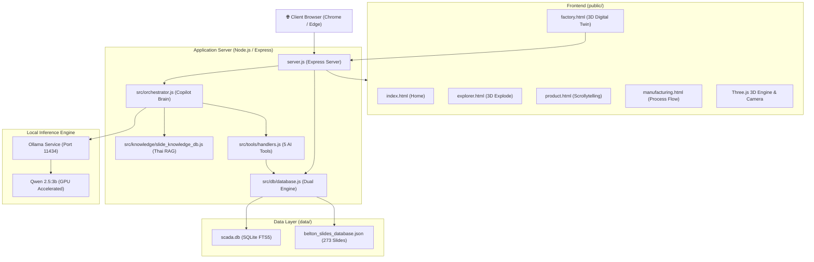

# BELTON Industrial 3D Digital Twin & AI SCADA Fleet

> **Enterprise-Grade Smart Manufacturing Platform**  
> เว็บแอปพลิเคชันจำลองโรงงานคลีนรูม 3 มิติเสมือนจริง (Digital Twin), ระบบมอนิเตอร์เครื่องจักร SCADA แบบเรียลไทม์ 50 เครื่อง, และวิศวกรผู้ช่วย AI Copilot (100% Local GPU) พร้อมฐานข้อมูลสไลด์ฝึกอบรมวิศวกรรม

---

## 🌟 จุดเด่นของระบบ (Key Capabilities)

1. **3D Cleanroom Digital Twin**: จำลองสภาพแวดล้อมคลีนรูม Class 100 ของโรงงาน Belton นวนคร ด้วยโมเดล 3D ความละเอียดสูง (Three.js) พร้อมระบบเดินสำรวจแบบ First-Person และมุมมอง Bird-Eye View
2. **Real-Time Fleet SCADA**: จำลองและเชื่อมต่อระบบ Telemetry ติดตามเครื่องจักรหยอดกาวอัตโนมัติ (Asymtek Dynamic Dispenser) 50 เครื่อง ติดตามค่า Yield, Cpk, แรงดันลม CDA, อุณหภูมิ Pre-heat, การสึกหรอของหัวเข็ม และปริมาณกาว
3. **Local AI Copilot (Qwen 2.5:3b + RAG)**: วิศวกร AI ผู้ช่วยประจำโรงงาน รันบน Local GPU 100% ตอบคำถามวิเคราะห์เครื่องจักร พร้อมอ้างอิงสไลด์ฝึกอบรมวิศวกรรมครบ 273 หน้า (135,664 ตัวอักษร) แบบเรียลไทม์
4. **Interactive 3D Component Explorer**: ถอดประกอบและระเบิดชิ้นส่วน (Explode View) โมเดลฮาร์ดดิสก์ HDD Actuator Coil ด้วยระบบฟิสิกส์ 3 มิติ
5. **Product & Manufacturing Scrollytelling**: นำเสนอสินค้า 4 หมวดหมู่ (APFA, ACA, FCOF, COIL) ด้วยอนิเมชัน 240 เฟรม และโฟลว์กระบวนการผลิตทั้งโรงงาน

---

## 🏗️ สถาปัตยกรรมระบบ (System Architecture)



---

## 📁 โครงสร้างโปรเจกต์และหน้าที่ของแต่ละส่วน (Codebase Map)

```text
belton_live_preview/
├── ClickToRun.bat                # สคริปต์ 1-Click เปิดระบบอัตโนมัติบน Windows
├── DEPLOYMENT_GUIDE.md           # คู่มือขึ้นระบบอย่างละเอียดสำหรับทีม IT / DevOps
├── README.md                     # เอกสารสถาปัตยกรรมและรายละเอียดโค้ด (ไฟล์นี้)
├── package.json                  # รายการ Dependencies และ Scripts ของ Node.js
├── package-lock.json             # Lockfile ระบุเวอร์ชันแพ็กเกจที่แน่นอน
├── server.js                     # Express Server หลัก ดูแล Routing, REST APIs และ AI Proxy
├── .env                          # ค่าตัวแปรสภาพแวดล้อม (Local)
├── .env.example                  # เทมเพลตตัวแปรสภาพแวดล้อมสำหรับ Production
├── .gitignore                    # กฎการละเว้นไฟล์ขยะและ logs ออกจาก Git
│
├── src/                          # โค้ดส่วน Backend Logic หลัก
│   ├── db/
│   │   └── database.js           # เชื่อมต่อ SQLite / PostgreSQL + Auto-seed อัตโนมัติเมื่อติดตั้งใหม่
│   ├── knowledge/
│   │   ├── belton_knowledge.js   # องค์ความรู้ทางวิศวกรรม Cleanroom, ESD, Contamination
│   │   └── slide_knowledge_db.js # ระบบค้นหาสไลด์ความเร็วสูง <1ms พร้อม Thai Tokenizer
│   ├── tools/
│   │   ├── schemas.js            # ข้อกำหนด Function Calling ของ AI Copilot (5 เครื่องมือ)
│   │   └── handlers.js           # โค้ดประมวลผลคำสั่งของแต่ละเครื่องมือ
│   └── orchestrator.js           # สมองกล AI Copilot ควบคุม RAG, กรองคำตอบ และเชื่อมต่อ Ollama
│
├── data/                         # แหล่งจัดเก็บข้อมูลหลัก
│   ├── belton_slides_database.json # ฐานข้อมูลสไลด์ฝึกอบรม 273 หน้า (JSON Master)
│   └── scada.db                  # SQLite Database (เครื่องจักร SCADA 50 เครื่อง + สไลด์ FTS5)
│
├── scripts/                      # สคริปต์อำนวยความสะดวก
│   └── extract_slides_to_db.py   # สคริปต์ Python สำหรับสกัดสไลด์ PDF เข้าฐานข้อมูล
│
├── ai/                           # AI / ML Training & Offline Pipelines
│   ├── models/                   # โมเดล Deep Learning (.pt และ .json)
│   ├── scripts/                  # สคริปต์สตรีมและจำลองข้อมูล SCADA
│   └── train_dispensing_ai.py    # โค้ดเทรน Neural Network เครื่องหยอดกาว
│
└── public/                       # Frontend Web Application (Client Side)
    ├── index.html                # หน้าหลัก / Landing Page / หุ่นยนต์ 3D แนะนำโรงงาน
    ├── explorer.html             # หน้า 3D HDD Component Explorer (แยกชิ้นส่วน Explode View)
    ├── product.html              # หน้านำเสนอสินค้า Scrollytelling 4 หมวด (APFA, ACA, FCOF, COIL)
    ├── manufacturing.html        # หน้านำเสนอโฟลว์กระบวนการผลิตทั้งโรงงาน
    ├── factory.html              # หน้า 3D Digital Twin คลีนรูม + แผงควบคุม SCADA 50 เครื่อง + AI Copilot
    ├── styles.css, factory.css, product.css, manufacturing.css # สไตล์ชีตของแต่ละหน้า
    ├── js/                       # สคริปต์ฝั่ง Frontend
    │   ├── main.js               # จัดการหน้าแรกและ 3D Scene เบื้องหลัง
    │   ├── factory.js            # ควบคุมโรงงาน 3D Three.js, SCADA Cards, และแผงแชต AI
    │   ├── product.js            # ควบคุม Scrollytelling 240 เฟรม
    │   ├── manufacturing.js      # จัดการ Interactive Flow ในหน้ากระบวนการผลิต
    │   ├── robot3d.js            # หุ่นยนต์ 3D แนะนำโรงงาน
    │   ├── audio.js              # เสียง Sound Effects แบบ Interactive
    │   ├── scada_machines_data.js# ข้อมูลเริ่มต้นเครื่องจักรฝั่ง Client
    │   └── webllm_copilot_service.js # บริการ AI สำรองฝั่ง Client
    ├── models/                   # โมเดล 3D และน้ำหนัก AI ในเว็บ
    │   ├── belton_factory_cleanroom_full.glb # โมเดลโรงงานคลีนรูม 3 มิติ
    │   ├── coil.glb              # โมเดลชิ้นส่วน HDD Actuator
    │   ├── dispensing_model_weights.json    # น้ำหนัก Neural Network ทำนายกาว
    │   └── chatbot_copilot_weights.json     # น้ำหนัก NLP สำรอง
    ├── frames/, frames_b/, frames_c/, frames_d/ # ภาพอนิเมชันสินค้า 240 เฟรมต่อหมวด
    └── assets/                   # เสียงและภาพประกอบ
```

---

## 🚀 เริ่มต้นใช้งานด่วน (Quick Start)

### วิธีที่ 1: แบบ 1-Click บน Windows
ดับเบิ้ลคลิกไฟล์ **`ClickToRun.bat`**  
ระบบจะตรวจสอบ Node.js, ติดตั้ง Dependencies (หากยังไม่มี), เปิดเว็บเบราว์เซอร์ และเริ่มเซิร์ฟเวอร์ให้อัตโนมัติทันที

### วิธีที่ 2: สั่งงานผ่าน Command Line
```bash
# 1. ติดตั้ง Dependencies
npm install

# 2. เริ่มเซิร์ฟเวอร์
npm start
```
เปิดใช้งานที่: **`http://localhost:8080`**  
- **รหัสผ่านเข้าสู่ระบบ**: Username: `admin` | Password: `60632`

---

## 🛠️ รายละเอียดทางเทคนิค (Technical Specifications)

| ส่วนประกอบ | เทคโนโลยีที่เลือกใช้ | รายละเอียด |
|---|---|---|
| **Runtime** | Node.js (v18.0+) | Express Framework สำหรับ Web Server และ REST APIs |
| **3D Rendering** | Three.js (WebGL) | เรนเดอร์โมเดล 3D คลีนรูม, แสงเงา PBR, กล้อง Orbit / First-Person |
| **Database** | SQLite / `better-sqlite3` | รองรับ FTS5 Full-Text Search, Self-bootstrapping ไม่ต้องติดตั้ง DB แยก |
| **Local AI** | Ollama (`qwen2.5:3b`) | รันบน GPU Local, รองรับ Function Calling 5 เครื่องมือ และ RAG สไลด์ 273 หน้า |
| **Response Time** | < 1 ms (DB Search) / ~4-9s (AI Full Answer) | ปรับแต่ง Context Window 8192 tokens ไม่เปลือง VRAM การ์ดจอ |

---

## 📖 เอกสารเพิ่มเติม
- สำหรับรายละเอียดขั้นตอนการขึ้นระบบ Production บน Server ของบริษัท โปรดอ่านต่อที่ [**`DEPLOYMENT_GUIDE.md`**](file:///c:/Users/BOAT/Videos/เลขา/belton_live_preview/DEPLOYMENT_GUIDE.md)
